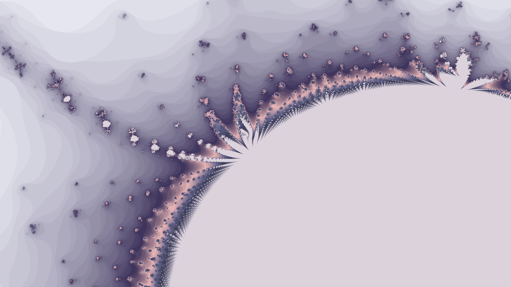

These are fractal renders I made using [my renderer](https://github.com/valflrt/fractal_rndr).

This set of images is licensed under [CC BY 4.0](https://creativecommons.org/licenses/by/4.0).

> No particular order here

<!-- IMAGES -->

